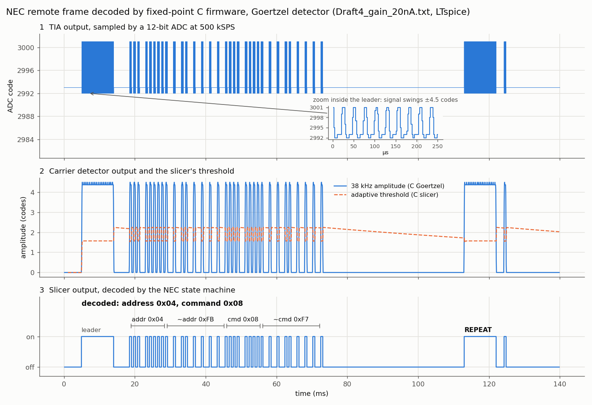
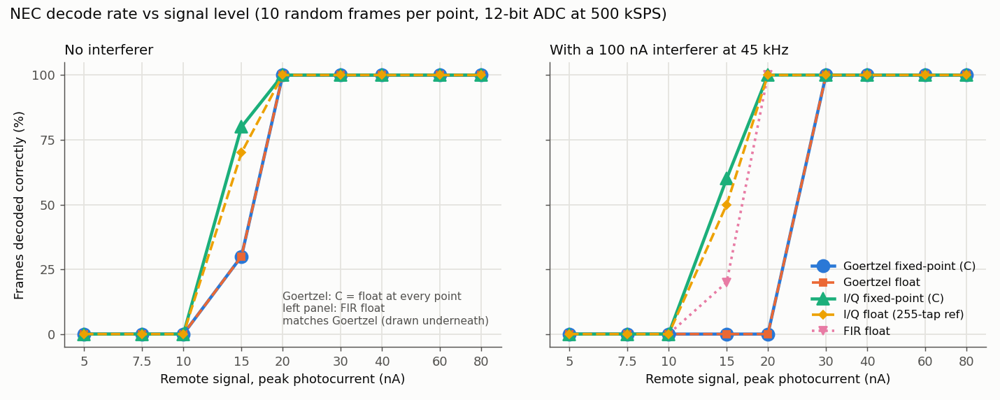
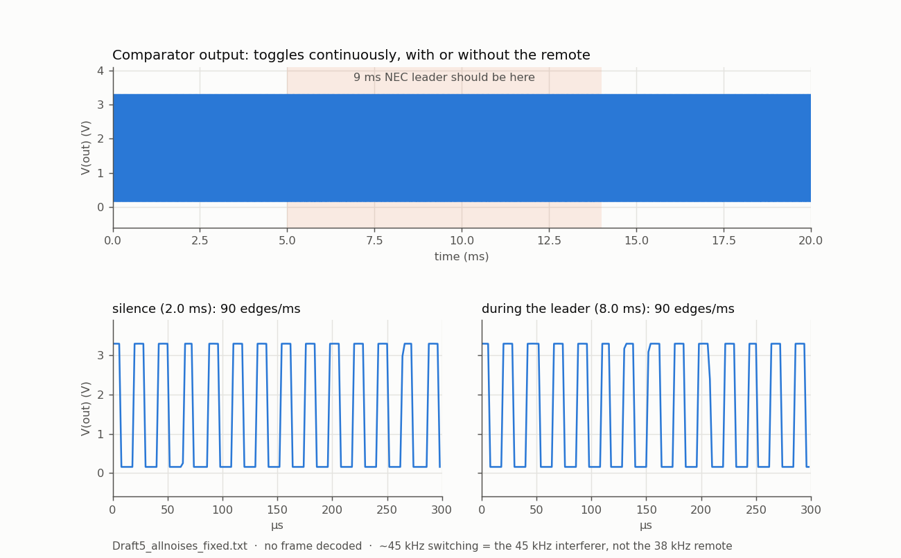
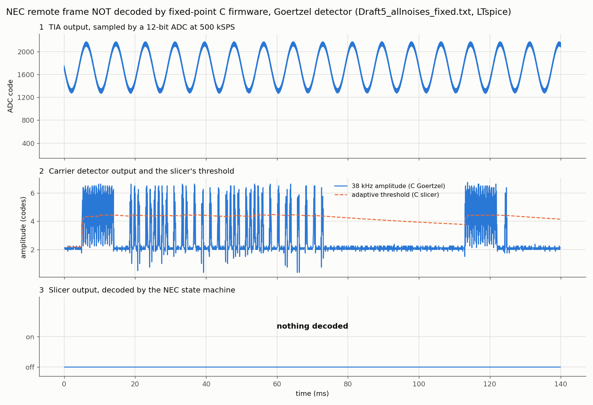
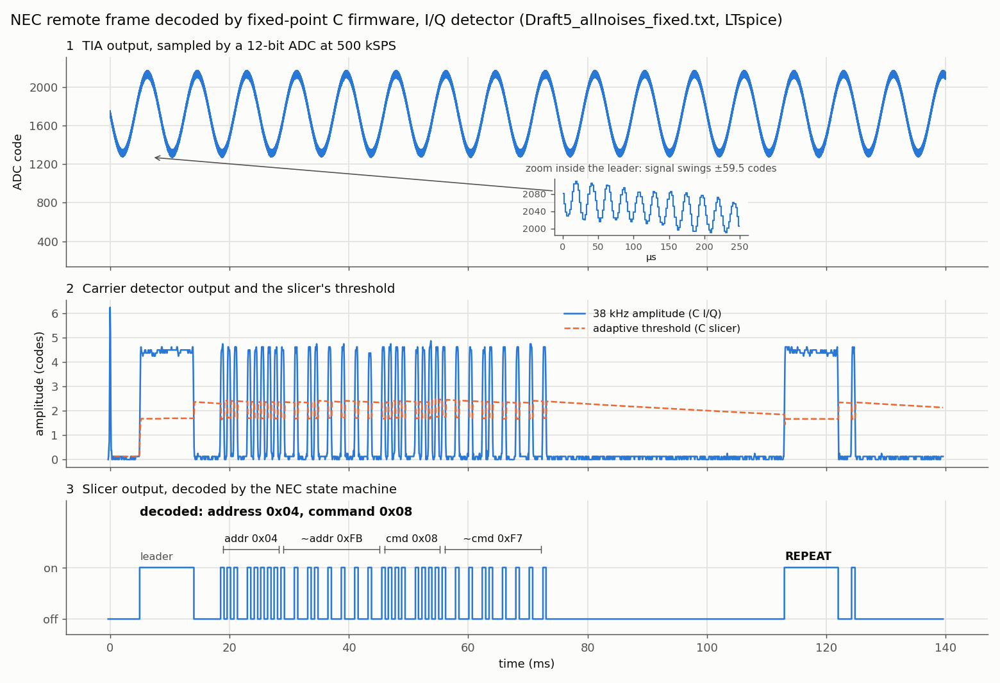
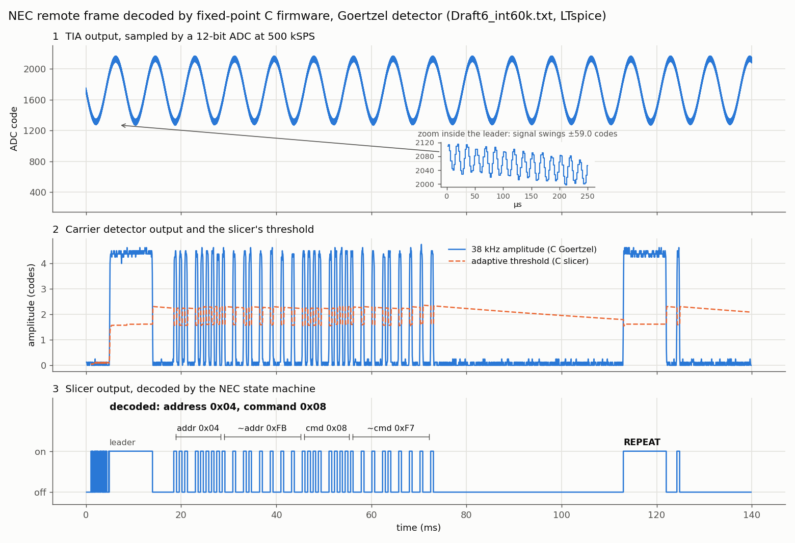
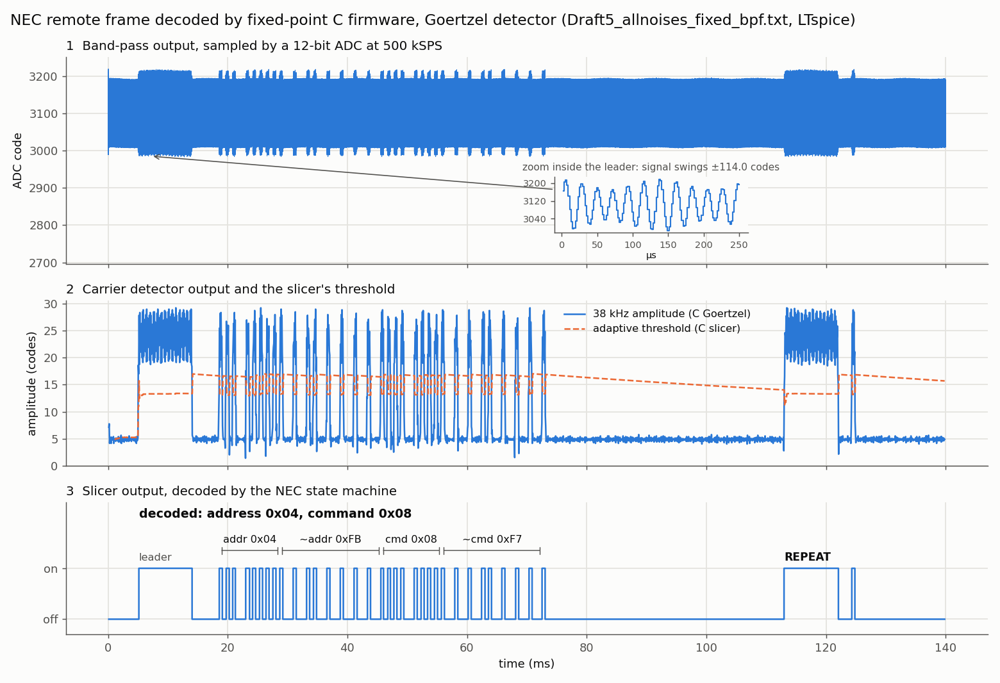

# IR receiver: analog comparator vs DSP detection

Simulation study, 2026-09-25. An analog IR remote receiver (BPW34 photodiode,
LM324 transimpedance amplifier, 38 kHz band-pass filter) with two detection
paths: an analog comparator, and a DSP path that samples the TIA output with a
12-bit ADC at 500 kSPS. The circuit was simulated in LTspice with an NEC remote
frame (address 0x04, command 0x08, plus a repeat code) as the photocurrent. The
DSP pipeline ran on the exported waveforms and on a synthetic front-end model.
No hardware has been built yet.





## Headline results

| | Comparator (analog) | DSP, Goertzel (C) | DSP, I/Q (C) |
|---|---|---|---|
| Original circuit, 100 nA remote | fails: never switches | decodes | decodes |
| After analog fixes, 20 nA remote | decodes | decodes | decodes |
| 100 nA lamp interferer at 45 kHz | false-triggers continuously | decodes from 30 nA | decodes from 20 nA |
| All noise sources at once, 20 nA remote (LTspice) | **fails**: toggles at 45 kHz throughout | **fails** | **decodes** |
| 45 kHz rejection relative to 38 kHz | 7.4 dB (one band-pass), ~15 dB (two) | ~25 dB | ~70 dB |
| Arithmetic | — | 64-bit products | 16×16→32-bit only |

## Analog path: what failed and what fixed it

1. **The original comparator never triggered at 100 nA.** The band-pass output
   swung ±97 mV about 2.5 V, but the threshold was a fixed 3.0 V. Its + input
   peaked at 2.52 V, 0.48 V short.
2. **Threshold alone was not enough.** Referencing the threshold to VDC
   (VDC + 36 mV) and cutting hysteresis (R11 330k → 1 MΩ) got within 14 mV
   at 50 nA, but still did not trigger.
3. **Gain plus threshold works.** A ×10 inverting stage (AC-coupled) with the
   threshold at VDC + 110 mV decoded the full frame and repeat at **100 nA and
   20 nA**, with no false edges.
4. **Room light does not clip the TIA (after fixing a simulation error).**
   The first LTspice runs had the photocurrent source reversed relative to the
   PCB (D1 cathode to 5 V, anode to the TIA input). That made the output rise
   into the LM324's ~3.5 V ceiling and appear to clip 43–48% of the time.
   With the real polarity the output falls from ~2.5 V toward 0 V: 1 µA plus
   2 µA ± 1 µA of 120 Hz flicker gives V(tia) 1.08–1.75 V, **0% clipped**, all
   ~680 leader edges. The TIA saturates at **~7.5 µA** (2.5 V / 330k).
5. **A DC servo is not needed at room-light levels.** An integrator driving the
   TIA's + input was designed against the reversed polarity. With the real
   polarity it would have to raise the reference, and the LM324's ~3.5 V limit
   caps centring at ~3 µA. For bright light, the better options are a
   daylight-filtered photodiode or a servo that sinks current from the TIA
   input through a resistor.
6. **A 45 kHz interferer defeats the comparator.** With 100 nA at 45 kHz (an
   electronic lamp ballast), the comparator toggled at 45 kHz continuously.
   A second band-pass (Ra 4.7k, Rb 1.1k, Rc 100k, 360 pF, tuned in simulation
   because the LM324 detunes textbook values from 38 kHz to 32 kHz) halved the
   interferer (1,329 → 655 mV p-p), but it is still 1.7× the 20 nA remote. No
   threshold separates them. Estimated tolerance: ~40 nA of 45 kHz interference.

## DSP path

- **Pipeline:** Goertzel carrier detector (N=128, Hann, new block every 32
  samples) → adaptive slicer (noise-floor tracking, hysteresis, 4× SNR gate) →
  run-length glitch merge (<150 µs) → NEC state machine (standard/extended
  addresses, repeat codes).
- **Fixed-point C port** (`firmware/`): integer only, streaming (one ADC code
  in, frames out), 32-bit state with 64-bit products.
  - Goertzel is **bit-exact** against an integer Python model, within **0.16
    ADC codes** of floating point.
  - The slicer agrees with the Python slicer on **100% of bits** (0 of ~2,100
    differ per run).
  - Decoded frames are identical to the float pipeline on every LTspice export
    and synthetic case. Interference alone decodes nothing.
- **Sensitivity** (10 random frames per point, 3 mV rms noise, flicker, 12-bit
  ADC):
  - All methods reach 100% at 20 nA without an interferer.
  - With a 100 nA 45 kHz interferer, I/Q and FIR reach 100% at 20 nA and
    Goertzel at 30 nA.
  - At 20 nA the whole carrier is only ~±4.5 ADC codes, so ADC resolution, not
    arithmetic, now limits weak signals.

## Goertzel vs I/Q under combined interference

The hardest LTspice run (`Draft5_allnoises_fixed.txt`) combined a 20 nA
remote with 1 µA of steady light, 2 µA ± 1 µA of 120 Hz flicker, a 45 kHz
interferer swinging 0–200 nA (100 nA amplitude) and ~1.4 nA rms of broadband
noise. The circuit is the ×10-gain version with one band-pass and no servo, with
every source injecting in the real photodiode direction. V(tia) stays within
1.02–1.75 V, so nothing clips; the difference between the paths is purely how
well each rejects the 45 kHz interferer. (An earlier run with the source
reversed gave the same three outcomes.)

- **The comparator fails.** Its output switches at ~90 edges/ms (45 kHz) in
  silence and during the 9 ms leader alike, so the remote is invisible in it.
  The band-pass passes the 100 nA interferer at a larger amplitude than the
  20 nA remote, and no threshold can separate them.

- **Goertzel fails.** Its 128-sample (256 µs) window cannot separate 38 kHz
  from 45 kHz well: about 5% of the interferer leaks through, which lifts the
  envelope floor to ~2 codes against ~6.5-code peaks. The slicer's 4× SNR gate
  never opens (peak/floor ≈ 3). Lowering the gate only recovers the
  repeat code, because 38/45 kHz beating breaks up the bursts. The float
  Goertzel fails identically, so this is the algorithm's limit, not the port's.
- **I/Q decodes it.** The firmware version mixes to baseband with a 250-entry
  table (38/500 = 19/250), decimates by 8 with a 3rd-order CIC, then applies a
  48-tap Kaiser FIR (3 kHz cutoff) with decimation by 4. It keeps the same
  15.625 kHz output rate as the Goertzel, so the slicer is shared. The 7 kHz
  offset interferer is attenuated by ~70 dB (the 255-tap Python reference
  gives 70.6 dB), and the envelope floor stays at ~0.1 codes. Cost is about
  1.5 M multiply-accumulates/s plus 1 M mixer multiplies/s, all 16×16→32-bit.
- The fixed-point I/Q is bit-exact against an integer model and within 0.2
  codes of a float model of the same structure. In the sweep it matches or
  beats the 255-tap reference at every level.





## Interferer frequency sweep (LTspice)

Same circuit and noise as above, one variable changed per run (`sim/drafts/Draft6_*.asc`).
"Ratio" is the Goertzel envelope's leader peak over its silent floor; the slicer needs ≥ 4.

| Run | Comparator | Goertzel (C) | I/Q (C) |
|---|---|---|---|
| 45 kHz interferer (baseline) | fails (45 kHz switching) | fails (ratio 3.1) | decodes |
| 60 kHz interferer | fails (60 kHz switching) | **decodes** (floor < 0.1 code) | decodes |
| 100 kHz interferer | decodes | decodes | decodes |
| No interferer | decodes | decodes | decodes |
| 45 kHz, flicker 60 Hz / 100 Hz instead of 120 Hz | fails | fails (ratio 3.0 / 3.1) | decodes |

The Goertzel's weakness is specifically an interferer inside its Hann main lobe
(±2 bins = ±7.8 kHz around 38 kHz); at 22 kHz away it is fine. The flicker
frequency does not matter to any path. The comparator survives only when the
analog band-pass and the TIA's ~103 kHz pole remove the interferer (100 kHz).



## Where to put the ADC: TIA vs band-pass vs ×10 output

Same six LTspice runs, same C firmware, ADC moved along the analog chain
(values from the `.raw` files; "ratio" = Goertzel leader peak / silent floor, gate ≥ 4).

| Tap point | Carrier at ADC | 45 kHz run: Goertzel | 45 kHz run: I/Q | Notes |
|---|---|---|---|---|
| TIA output | ~4.5 codes | fails (ratio 3.1) | decodes | flicker ±410 codes dominates the ADC range |
| Band-pass output | ~24 codes | **decodes (ratio 5.9)** | decodes | 2.40–2.59 V, flicker gone |
| ×10 output | ~226 codes | decodes (ratio 5.9) | decodes | 1.63–3.35 V: exceeds a 3.3 V ADC 0.6% of the time |

All other runs (60 kHz, 100 kHz, no interferer, 60/100 Hz flicker) decode on every
path at every tap. The analog band-pass's few dB of extra 45 kHz rejection is
enough to lift the Goertzel over its SNR gate; the ×10 stage adds amplitude but no
selectivity, so it does not improve the ratio further. I/Q's peak/floor stays
~70 at every tap because the white noise is amplified along with the signal. A
larger carrier still matters on hardware, where real ADC noise (not modelled here)
is a code or more. The ×10 output needs rescaling (and centring at ~1.65 V) for a
3.3 V ADC.



## Limits of this study

- Everything is simulated. Noise is injected (LTspice transient analysis has
  no device noise), and the LM324 and LT1011 are vendor macromodels.
- The comparator-path fixes (servo, second band-pass, threshold) are
  simulation-only; the KiCad schematic and PCB do not include them yet.
- Firmware CPU cost on the target MCU is unmeasured. The Goertzel resonator
  uses 64-bit multiplies, which are library calls on the RP2040's Cortex-M0+;
  the I/Q path avoids them.
- Realism: the 100 nA 45 kHz interferer models a nearby CFL / electronic-ballast
  lamp and is a stress case. The steady background (1–4 µA) is probably
  optimistic for an unfiltered BPW34 under incandescent light or daylight; a
  daylight-filtered photodiode (BPW34F) would reduce it.
- Sweeps use 10 trials per point, so rates are coarse (10% steps).

## Reproduce

```
python test_goertzel_fixed.py   # C Goertzel: bit-exact + float comparison
python test_ir_rx.py            # C receiver end to end vs the Python pipeline
python test_iq_fixed.py         # C I/Q detector: bit-exact + float + decodes
python sweep_fixed.py           # decode-rate chart (decode_rate.png)
python demo.py                  # pipeline figure (demo.png) from ../sim/exports/Draft4_gain_20nA.txt
python demo.py ../sim/exports/Draft5_allnoises_fixed.txt --detector iq --out demo_iq_allnoises.png
python demo.py ../sim/exports/Draft5_allnoises_fixed.txt --detector goertzel --out demo_goertzel_allnoises.png
python comparator_demo.py       # comparator figure (comparator_allnoises.png) from the same run
```
The tests build with MSYS2 GCC (`C:/msys64/ucrt64/bin/gcc.exe`, or set `GCC`).
LTspice exports are read from `../sim/exports/Draft*.txt` (gitignored; re-export from `../sim/drafts/*.asc`).
