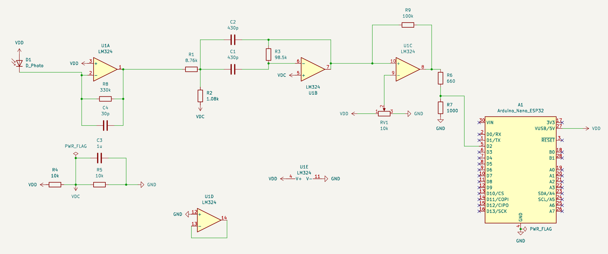
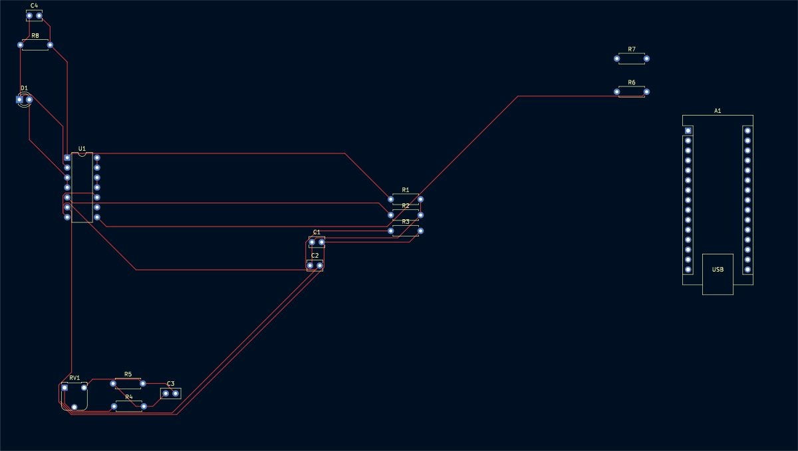
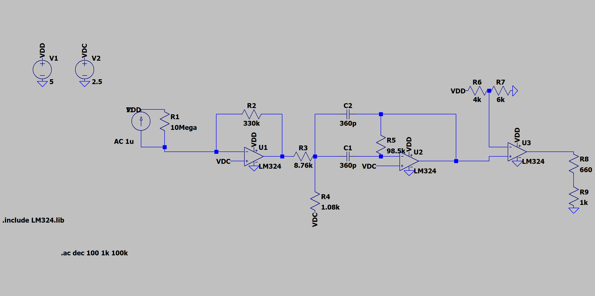
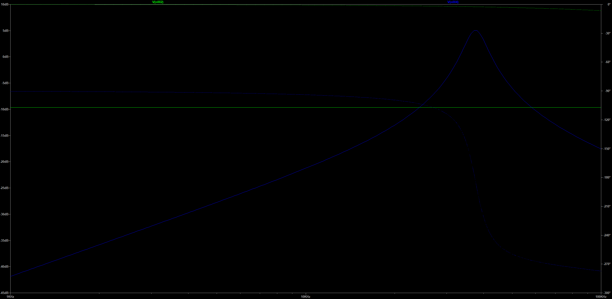
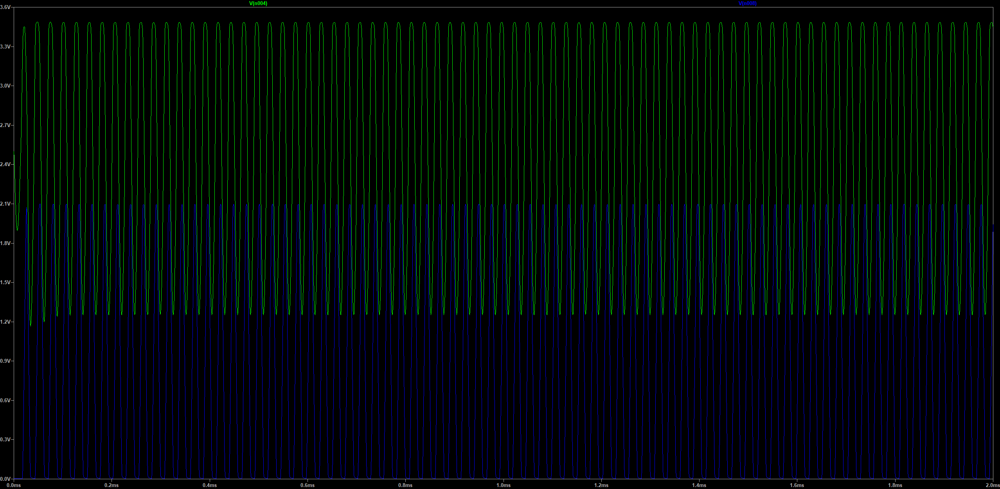
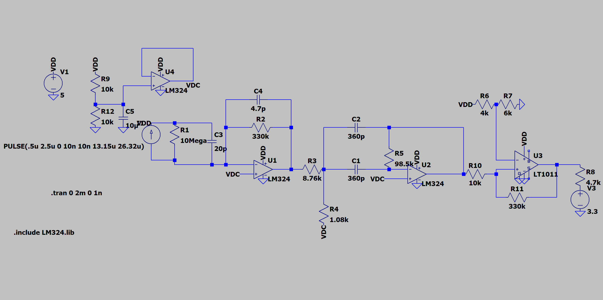
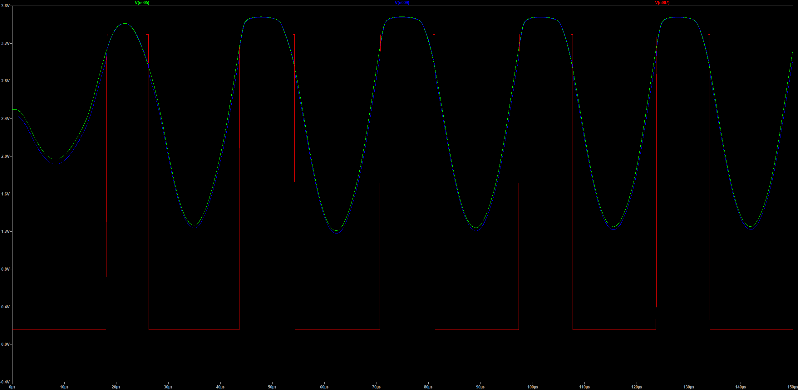

# Infrared Receiver Signal Chain

Four-stage discrete receiver for 38 kHz-modulated IR remote signals — the job an
integrated TSOP module does in one package, built stage by stage so each design
decision is visible. The KiCad revision builds all four stages from sections of a
single LM324. The latest LTspice draft (Draft 3) moves the comparator to an LT1011
with hysteresis and drives a 3.3 V logic output for an ESP32 decoder; see
[What's new in Draft 3](#whats-new-in-draft-3).

## Repository layout

| Folder | Contents |
|---|---|
| `pcb/` | KiCad 10 project (`.kicad_pro/.kicad_sch/.kicad_pcb`); `pcb/gerbers/` holds the fab outputs |
| `sim/` | Documented LTspice testbenches (Drafts 1-3) and `LM324.lib` |
| `sim/drafts/` | Working LTspice drafts 3-5: NEC-frame stimulus, ×10 gain stage, noise tests, DC servo |
| `sim/exports/` | Waveform exports the DSP scripts read (gitignored; re-export from `sim/drafts/`) |
| `DSP/` | Python + fixed-point C decoders (Goertzel, I/Q) that replace the comparator; see [`DSP/RESULTS.md`](DSP/RESULTS.md) |
| `docs/` | Figures used in this README |

## Signal chain

```
Photodiode → Transimpedance amp → 38 kHz bandpass → Comparator → Output conditioning
```

| Stage | Purpose |
|---|---|
| Transimpedance amplifier | Photodiode current to voltage, 330 kV/A (330 mV/µA) |
| Bandpass filter | 38 kHz center; rejects 120 Hz ambient-light interference |
| Comparator | Squares the recovered envelope to a logic level; Draft 3 adds about 100 mV of hysteresis (LT1011, 10 kΩ / 330 kΩ) |
| Output conditioning | Logic-level output for the ESP32 decoder: 660 Ω / 1 kΩ divider on the board, 4.7 kΩ pull-up to 3.3 V in Draft 3 |

## Schematic



*KiCad schematic, exported with kicad-cli.*



*KiCad board: outline, copper, and front silkscreen.*



*LTspice testbench, `sim/receiver-chain-ac-response.asc`.*



*AC sweep, 1 kHz to 100 kHz, from `sim/receiver-chain-ac-response.asc`. V(n002) is the transimpedance output, V(n004) the bandpass output.*



*Transient response to a 38 kHz photocurrent pulse train, from `sim/receiver-chain-38khz-transient.asc`. V(n004) is the bandpass output, V(n008) the final output at the R8/R9 divider.*



*Draft 3 testbench, `sim/receiver-chain-hysteresis-transient.asc`: LT1011 comparator with hysteresis, buffered mid-rail bias, 4.7 kΩ pull-up to 3.3 V.*



*Draft 3 transient, first 150 µs. V(n005) is the bandpass output, V(n009) the comparator input with hysteresis, V(n007) the 3.3 V logic output.*

## Design decisions

**Transimpedance gain vs. stability.** 330 kV/A is a large feedback resistance,
and photodiode junction capacitance against it forms a pole that causes peaking
and can ring. The feedback network is sized to hold the gain while keeping the
stage stable against that capacitance — the central trade-off in this stage.

**Why bandpass rather than just high-pass.** Fluorescent and incandescent lighting
puts a 120 Hz component into the photodiode, well below the 38 kHz carrier. A
bandpass centered on the carrier rejects that and out-of-band noise above it.
Filter Q is the trade-off: too high and component tolerance walks the center
frequency off 38 kHz, too low and ambient rejection suffers.

**Why one LM324.** Four sections, four stages, one package — and the bandwidth is
adequate at 38 kHz. Draft 3 gives the comparator job to an LT1011 instead: a real
comparator with an open-collector output drives the 3.3 V logic line directly and
takes a hysteresis network cleanly, and the freed fourth LM324 section becomes the
mid-rail bias buffer.

## What's new in Draft 3

`sim/receiver-chain-hysteresis-transient.asc`, compared with the Draft 2 transient
testbench (values read from the netlists):

- **Comparator.** The third LM324 section is replaced by an LT1011. A 10 kΩ series
  resistor into the non-inverting input and 330 kΩ from the output back to it add
  about 100 mV of hysteresis referred to the bandpass output. The 3.0 V threshold
  (4 kΩ / 6 kΩ from 5 V) is unchanged.
- **Output.** The 660 Ω / 1 kΩ divider is gone; the LT1011's open-collector output is
  pulled up through 4.7 kΩ to a separate 3.3 V rail, so the decoder sees a 3.3 V logic
  signal directly.
- **Mid-rail bias.** The ideal 2.5 V source becomes a 10 kΩ / 10 kΩ divider with 10 µF,
  buffered by the fourth LM324 section.
- **Transimpedance stage.** 4.7 pF across the 330 kΩ feedback (corner near 103 kHz)
  against a modeled 20 pF photodiode capacitance.
- **Stimulus.** Photocurrent pulses of 0.5 to 2.5 µA at 38 kHz instead of 1 to 11 µA.
- **Unchanged.** 330 kΩ transimpedance gain, the bandpass (8.76 kΩ / 1.08 kΩ /
  98.5 kΩ / 360 pF), and `.tran 0 2m 0 1n`.

The LT1011 model ships with LTspice; the only local dependency is `sim/LM324.lib`.

## Simulation

Passband and comparator thresholds confirmed through LTspice AC and transient
simulation.

| File | What it runs |
|---|---|
| `sim/receiver-chain-ac-response.asc` | Draft 1: AC sweep, 1 kHz to 100 kHz, 1 µA photocurrent |
| `sim/receiver-chain-38khz-transient.asc` | Draft 2: transient, 1 to 11 µA pulses at 38 kHz |
| `sim/receiver-chain-hysteresis-transient.asc` | Draft 3: transient, 0.5 to 2.5 µA pulses, LT1011 comparator with hysteresis |

All three include `sim/LM324.lib` from the same folder.

## Layout

KiCad 10 project in `pcb/`: `AnalogIRRemoteReciever.kicad_pro`, `.kicad_sch` and
`.kicad_pcb`, a routed two-layer board carrying the LM324, the photodiode and an
Arduino Nano ESP32 as the decoder. The layout follows the LM324-only revision: 430 pF
bandpass capacitors (38 kHz centre by the MFB formula, where the LTspice drafts' 360 pF
land near 45 kHz), a 10 kΩ pot for the comparator threshold, and the 660 Ω / 1 kΩ
output divider. Draft 3's LT1011 comparator, hysteresis and buffered bias are not in
the layout yet.

## Open items

- [ ] Bench-measure passband center and Q against simulation
- [ ] Decode range under varying ambient light
- [ ] Bring the KiCad schematic and board up to Draft 3 (LT1011, hysteresis, buffered bias, 3.3 V pull-up)
- [ ] Reconcile the bandpass capacitors: 360 pF in the LTspice drafts vs 430 pF on the board
