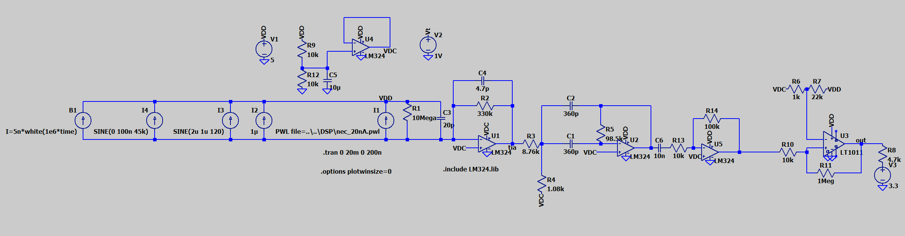

# Infrared Receiver Signal Chain

A discrete 38kHz IR Reciever, 4 fundamental analog stages followed by a fixed DSP decoder.

## Repository layout

| Folder | Contents |
|---|---|
| `pcb/` | KiCad 10 project (`.kicad_pro/.kicad_sch/.kicad_pcb`); `pcb/gerbers/` holds the fab outputs |
| `sim/` | Documented LTspice testbenches (Drafts 1-3) and `LM324.lib` |
| `sim/drafts/` | Working LTspice drafts 3-5: NEC-frame stimulus, ×10 gain stage, noise tests, DC servo |
| `sim/exports/` | Waveform exports the DSP scripts read (gitignored; re-export from `sim/drafts/`) |
| `DSP/` | Python + fixed-point C decoders (Goertzel, I/Q) that replace the comparator; see [`DSP/RESULTS.md`](DSP/RESULTS.md) |
| `docs/` | Figures used in this README |

## Signal chain

```
Photodiode → Transimpedance amp → 38 kHz bandpass → Comparator → Output conditioning
```

| Stage | Purpose |
|---|---|
| Transimpedance amplifier | Photodiode current to voltage, 330 kV/A (330 mV/µA) |
| Bandpass filter | 38 kHz center; rejects 120 Hz ambient-light interference |
| Comparator | Squares the recovered envelope to a logic level; Draft 3 adds about 100 mV of hysteresis (LT1011, 10 kΩ / 330 kΩ) |
| Output conditioning | Logic-level output for the ESP32 decoder: 660 Ω / 1 kΩ divider on the board, 4.7 kΩ pull-up to 3.3 V in Draft 3 |

## Schematic



<h3>Noise sources in the LTspice testbench</h3>

<p>Every source is a current source from VDD into the photodiode node, so it adds photocurrent
the way real light does. Voltages are the effect at the TIA output (× 330 kΩ).</p>

<table>
  <thead>
    <tr>
      <th>Part</th>
      <th>LTspice value</th>
      <th>What it models</th>
      <th>Size</th>
      <th>Effect at V(tia)</th>
    </tr>
  </thead>
  <tbody>
    <tr>
      <td><b>I1</b></td>
      <td><code>PWL file=..\..\DSP\nec_20nA.pwl</code></td>
      <td><b>The signal:</b> NEC remote frame, 38 kHz carrier at 1/3 duty</td>
      <td>20 nA pulses</td>
      <td>~6.6 mV pulses (carrier ≈ 4.5 ADC codes)</td>
    </tr>
    <tr>
      <td><b>I2</b></td>
      <td><code>1µ</code></td>
      <td>Steady room light / daylight</td>
      <td>1 µA DC</td>
      <td>−0.33 V shift</td>
    </tr>
    <tr>
      <td><b>I3</b></td>
      <td><code>SINE(2u 1u 120)</code></td>
      <td>Mains lamp flicker at 120 Hz (twice the 60 Hz mains)</td>
      <td>2 µA average ± 1 µA</td>
      <td>−0.66 V shift, ±0.33 V ripple (±410 codes)</td>
    </tr>
    <tr>
      <td><b>I4</b></td>
      <td><code>SINE(100n 100n 45k)</code></td>
      <td>Interfering IR at 45 kHz (CFL / electronic-ballast lamp)</td>
      <td>0–200 nA (100 nA average + 100 nA swing)</td>
      <td>−33 mV shift, ±33 mV (±41 codes)</td>
    </tr>
    <tr>
      <td><b>B1</b></td>
      <td><code>I=5n*white(1e6*time)</code></td>
      <td>Broadband random noise (stand-in for shot and amplifier noise), new value every 1 µs</td>
      <td>±2.5 nA uniform, ≈ 1.4 nA rms</td>
      <td>≈ 0.5 mV rms</td>
    </tr>
  </tbody>
</table>

<p>Also on the photodiode node, but part of the diode model rather than noise:
<b>R1 = 10 MΩ</b> (shunt leakage) and <b>C3 = 20 pF</b> (junction capacitance, which sets the TIA's
stability and bandwidth together with C4 = 4.7 pF).</p>

<p>Total average light is about 3 µA, so V(tia) sits near 2.5 − 0.99 ≈ 1.5 V (simulated
1.02–1.75 V), well clear of TIA saturation at about 7.5 µA. LTspice transient analysis has no
built-in device noise (resistor, op-amp or photodiode shot noise); B1 stands in for it.</p>

<h4>Variants (<code>sim/drafts/</code>)</h4>

<table>
  <thead>
    <tr>
      <th>File</th>
      <th>Change from the all-noises testbench</th>
    </tr>
  </thead>
  <tbody>
    <tr><td><code>Draft6_int60k.asc</code></td><td>I4 → <code>SINE(100n 100n 60k)</code></td></tr>
    <tr><td><code>Draft6_int100k.asc</code></td><td>I4 → <code>SINE(100n 100n 100k)</code></td></tr>
    <tr><td><code>Draft6_flicker60.asc</code></td><td>I3 → <code>SINE(2u 1u 60)</code></td></tr>
    <tr><td><code>Draft6_flicker100.asc</code></td><td>I3 → <code>SINE(2u 1u 100)</code></td></tr>
    <tr><td><code>Draft6_no45k.asc</code></td><td>I4 → <code>0</code></td></tr>
    <tr><td><code>Draft6_clean.asc</code></td><td>I2, I3, I4 → <code>0</code>; B1 → <code>I=0</code> (20 nA remote only)</td></tr>
  </tbody>
</table>

## Sim Results

Different simulations running assuming a 38kHz signal strength of 20nA from photodiode. With no interference from other sources, the comparator decodes the frame cleanly. Adding room lights, flickers, and noise did not break it either. A 45kHz source however does and passes through the analog bandpass filter along with the 38kHz remote signal and results in a failure to decode.
Results from the final 'out' node given just the comparator.


## Goertzel Algorithm Implementation

If instead, connect the a microcontroller directly after the bandpass filter and use the microcontroller to apply the DFT to isolate the 38kHz signal using the Goertzel algorithm, it is achievable to decode the signal w/o any comparator subcircuit. 


The combination of the bandpassfilter and Goertzel implementation coorelating last N number of samples with 38kHz reference and reports amplitude every 64µs. 38kHz component adds up while other frequencies are averaged towards zero. The adaptive slice functions as a way to turn the signal on and off by adjusting the threshold in accordance with the formula:

### How the receiver decides "on" or "off" (adaptive threshold)

The detector outputs a number every 64 µs: how strong the 38 kHz signal is right now.
To turn that into on/off, the receiver compares it to a threshold that **adjusts itself**.

It keeps track of two levels:

- **Quiet level (floor):** how strong the signal reads when the remote is *not* sending,
  i.e. background noise. It updates slowly (over about 20 ms) and only while nothing is being received.
- **Loud level (peak):** how strong the signal reads when the remote *is* sending. It jumps up
  immediately when a burst arrives and fades slowly (over about 150 ms) afterwards.

The threshold sits between the two:

    threshold = quiet level + 50% of the gap between quiet and loud

Once the output switches on, the threshold drops to **35%** of the gap. It switches back
off only when the signal falls clearly below the level that turned it on, so small wobbles
near the line can't make it flicker on/off/on.

**Why adaptive?** A remote across the room gives a much weaker signal than one up close,
and a noisy room raises the quiet level. A fixed threshold would be wrong in one case or
the other. Tracking the quiet and loud levels keeps the threshold halfway between them,
whatever they are. Commercial IR receiver chips do the same thing with automatic gain control.


