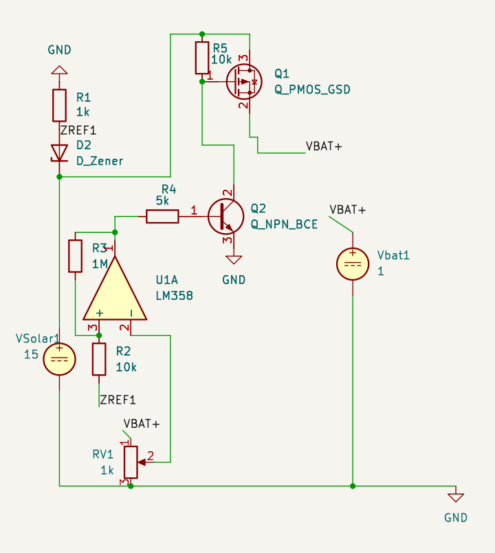

# Solar Charge Controller

Comparator-based charge controller for a lead-acid battery. When the battery
reaches its charge threshold the panel is disconnected; when it falls back below
the lower threshold the panel reconnects. No microcontroller — the whole control
loop is one comparator with positive feedback.

## Design

| Block | Implementation |
|---|---|
| Voltage reference | Zener diode |
| Comparison | LM358 with positive-feedback hysteresis |
| Switch | PMOS high-side |

**Cutoff:** 14.4 V
**Hysteresis window:** ~0.4 V

## Schematic

*KiCad schematic, exported with kicad-cli. No board layout yet.*

## Design decisions

**.4V hysteris** Without positive feedback:
the comparator trips, load changes, terminal voltage moves back across the
threshold, and switch oscillates. Panel output ripple makes this worse. The
0.4 V window is the trade-off.

**Why PMOS high-side.** Switching the positive rail keeps the battery negative
terminal common with the rest of the system. Body diode orientation has to be
checked so the panel can't backfeed when the switch is off.

**Why Zener reference.** Sets the trip point without a regulator. Open question
is tempco — whether the Zener drift tracks the battery's charge-voltage temperature
coefficient closely enough over the operating range.

## Simulation

Switching behavior verified in LTspice across input-voltage and battery-voltage
variation.

Files in `sim/`.

## Layout

KiCad schematic and board in `pcb/`.

## Open items

- [ ] Zener tempco vs. lead-acid charge voltage tempco across temperature
- [ ] Verify Vgs stays within spec over the full panel voltage range
- [ ] Reverse-current path when the panel is dark
- [ ] Bench measurement of actual trip points vs. simulated
